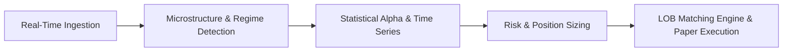

# High-Frequency Quantitative Algorithmic Trading Sandbox (ATSA)

[](https://github.com/Suryanshsaraf/High-Frequency-Quantitative-Algorithmic-Trading-Sandbox)
[](https://www.python.org/)
[](https://opensource.org/licenses/MIT)

A fully automated, event-driven quantitative trading sandbox that ingests real-time financial market data, identifies structural regime shifts, calculates institutional risk metrics, and simulates high-frequency paper trading.

---

## Architecture & Modules



### 1. Applied Time Series Modeling Engine (`modeling_engine.py`)
A modular statistical modeling pipeline executing sequential time series econometrics on live financial data:

1. **Data Ingestion**: Pulls 60 days of hourly (`1h`) asset prices from Yahoo Finance (`yfinance`).
2. **Log Return Transformation**: Stationarizes raw prices into continuously compounded log returns:
   $$r_t = \ln(P_t / P_{t-1})$$
3. **Unit Root Testing (ADF)**: Evaluates covariance stationarity with automated Augmented Dickey-Fuller tests and AIC lag selection.
4. **Conditional Mean Modeling (ARIMA)**: Fits $\text{ARIMA}(1, 0, 1)$ to capture autocorrelation and conditional mean structure:
   $$r_t = c + \phi_1 r_{t-1} + \theta_1 \epsilon_{t-1} + \epsilon_t$$
5. **Conditional Volatility Modeling (GARCH)**: Extracts mean model residuals $e_t$ and fits a $\text{GARCH}(1, 1)$ process to capture volatility clustering and conditional heteroskedasticity:
   $$\sigma_t^2 = \omega + \alpha_1 e_{t-1}^2 + \beta_1 \sigma_{t-1}^2$$
6. **Multi-Period Forecasting**: Projects the next 5 periods of expected mean return and conditional volatility.
7. **Diagnostic Verification (Ljung-Box)**: Evaluates standardized residuals $\eta_t = e_t / \sigma_t$ for white noise behavior at multiple lag checkpoints ($L = 10, 20$).

### 2. Quantitative Trading & Risk Execution Layer (`execution_logic.py`)
Consumes statistical forecasts from `modeling_engine.py` to drive an automated paper trading account:

1. **Mock Portfolio Tracker**: Manages simulated balances ($10,000 cash, 0 units), position transitions (`CASH` $\leftrightarrow$ `LONG`), mark-to-market valuations, and transaction logs.
2. **Dynamic Risk Thresholds**: Computes empirical 95th percentile volatility cutoffs from rolling absolute returns:
   $$\text{Threshold}_{95\%} = \text{Percentile}_{95}(|r_t|)$$
3. **Quantitative Signal Rules**:
   - **BUY**: If in `CASH` and GARCH volatility forecast $\le \text{Threshold}_{95\%}$ (calm market regime), deploy available cash.
   - **SELL / EXIT**: If `LONG` and GARCH volatility forecast $> \text{Threshold}_{95\%}$ (regime shift / extreme risk spike), liquidate position to `CASH` to protect capital.
   - **HOLD**: Maintain current position state.
4. **Streaming Simulator**: Line-by-line streaming runner emulating a real-time event loop with trade execution alerts and performance tear-sheets.

---

## Quick Start

### Installation
```bash
# Clone repository
git clone https://github.com/Suryanshsaraf/High-Frequency-Quantitative-Algorithmic-Trading-Sandbox.git
cd High-Frequency-Quantitative-Algorithmic-Trading-Sandbox

# Create virtual environment & install requirements
python3 -m venv .venv
source .venv/bin/activate
pip install -r requirements.txt
```

### Running the Scripts
```bash
# 1. Run Applied Time Series Modeling Engine
python3 modeling_engine.py BTC-USD

# 2. Run Quantitative Risk & Paper Execution Simulation
python3 execution_logic.py BTC-USD
```

### Programmatic Usage
```python
from execution_logic import simulate_streaming_execution

# Run 40-step streaming simulation on BTC-USD
portfolio, trade_log = simulate_streaming_execution(
    symbol="BTC-USD",
    simulation_steps=40,
    percentile=95.0,
    initial_cash=10000.0,
)
```

---

## Author
- [Suryansh Saraf](https://github.com/Suryanshsaraf)

